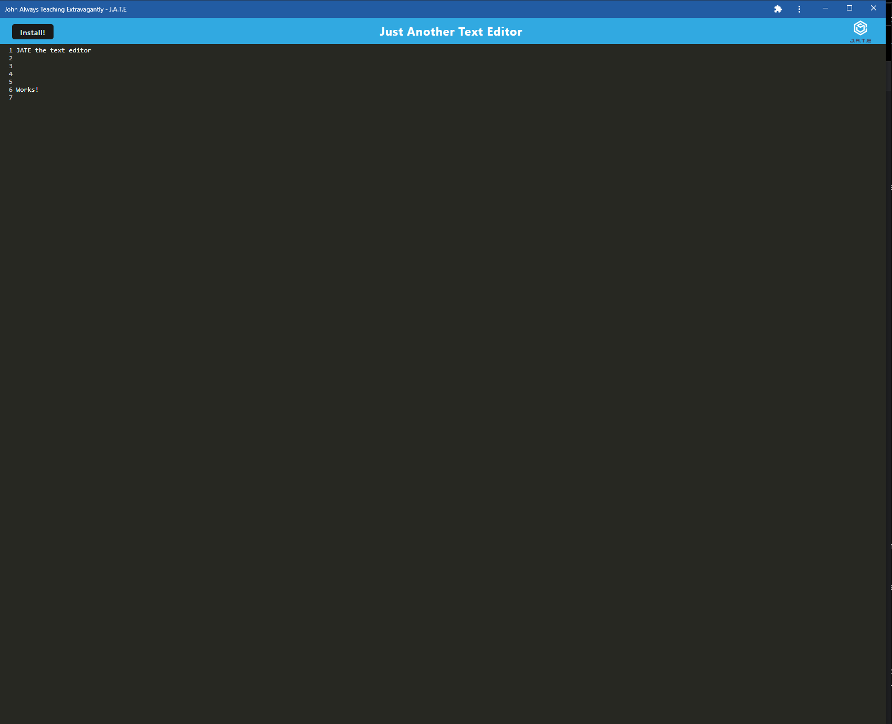

# M19 - Text Editor

## Description

Social Network API is a server database that allows the user to make get, post, put, and delete requests in order to fully manipulate data. It was made in order to practice MongoDB and Mongoose.

While building this project I learned to:
- Create a noSQL database through MongoDB
- Add virtuals to a model
- Add multiple routes to the same function instead of defining them individually

## Table of Contents
- [Installation](#installation)
    - [Screenshot](#screenshot)
- [Usage](#usage)
    - [Website](#website)
    - [Developer](#developer)
- [License](#license)
- [Contact](#contact)

## Installation

Text Editor is a deployed web application. Most users must simply navigate to [m19-text-editor.herokuapp.com/](https://m19-text-editor.herokuapp.com/)

Should you wish to download the project locally you must:

1. Clone the repo down to your local machine.
1. If you don't have Node.js, navigate to [nodejs.org](https://nodejs.org/en/) & download v16.18.0 or newer.
1. Install NPM packages using `npm i`

### Screenshot

## Usage

This section will describe how to use the website both from a regular users perspective and from a developers perspective. See website and developer sub-sections below.

### Website

As a user you may add notes to the application. It will save your notes to a database so you may leave the page and have the notes stay. 

Should you wish to have access to the text editor on your local device merely hitthe `Install` button at the top left of the screen. All of your notes will carry over.

### Developer

From your terminal, run `npm run start:dev` in order to generate a `dist` folder. You will see that within the dist we have a condensed Progressive Web Application.

In order to see the application at work navigate to [localhost:3000/](http://localhost:3000/) .

## License

MIT

## Contact

For any further questions feel free to contact me via:
- GitHub: [Ian Mosur](https://github.com/IanMosur06)
